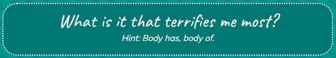
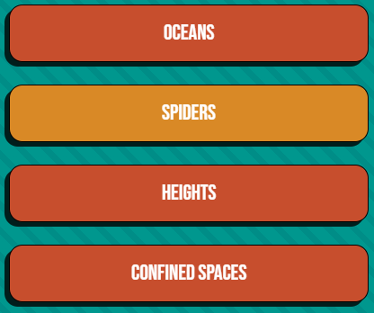
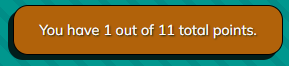
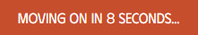
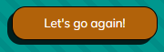

# The Liz Quiz
## Introduction
The Liz Quiz is a web based quiz game created to provide users with a fun way to test their current knowledge about me at the same time as they are learning things about me the user was not aware of before partaking in the quiz. 
The Quiz is built in JavaScript, HTML and CSS.

[View the project here](https://arcliz.github.io/pp2-quiz/) - *Please note: To open any links in this document in a new browser tab, please press CTRL + Click.*

## Table of Contents
* [User Experience Design (UX)](#UX)
    * [The Strategy Plane](#The-Strategy-Plane)
        * [Site Goals](#Site-Goals)
        * [User Stories](#User-Stories)
    * [The Scope Plane](#The-Scope-Plane)
    * [The Structure Plane](#The-Structure-Plane)
    * [The Skeleton Plane](#The-Skeleton-Plane)
        * [Wireframes](#Wireframe-mockups)
    * [The Surface Plane](#The-Surface-Plane)
        * [Design](#Design)
            * [Colour Scheme](#Colour-Scheme)
            * [Typography](#Typography)
            * [Imagery](#imagery)            
* [Features](#features)
* [Future Enhancements](#future-enhancements)
* [Testing](#testing)
* [Deployment](#deployment)
* [Credits](#credits)

## UX
### The Strategy Plane
The Liz Quiz is developed as an entertaining tool for users to get to know sides and facts about me and my life that might not commonly be known or ever mentioned in normal conversation.  The Quiz is developed with aquaintances and friends in mind as the target user group, as a fun game to use to both test their knowledge about me as well as getting to know new things about my life.

#### Site Goals
* To provide users with an easy to understand quiz
* To provide users with a fun design
* To ensure the content is interesting as well as entertaining
* To ensure the site is accessible to all potential users

#### User Stories
* As a user, I want a site with easy to understand navigation
* As a user, I want the game to be fun and easy to play
* As a user, I want to learn new things about Liz
* As a user, I want feedback for my answers and results

### The Scope Plane
In order for the site to provide the user with the functionality and experience set out in the Site Goals and User Stories, I plan to include the following features:
* Information on how the Quiz works
* A multiple choice Quiz
* Hints for each question that shows on a timer, should a user take too long to answer
* A fun fact related to each question
* A final results screen informing the user on how they did on the quiz

### The Structure Plan

User Story (#1):
> As a user, I want a site with easy to understand navigation

Implementation:
* The site will be divided into multiple pages to limit information

User Story (#2):
> As a user, I want the game to be fun and easy to play

Implementation:
* The quiz content will be unexpected and entertaining
* The quiz will run on javascript animations so that the user interaction required is minimized

User Story (#3):
> As a user, I want to learn new things about Liz

Implementation:
* The quiz will provide additional question related facts

User Story (#4):
> As a user, I want feedback for my answers and results

Implementation:
* The site will include score tracking, direct and final result information

### The Skeleton Plane

#### Wireframe mockups
At project inception I've found that losely sketching wireframes using pen and paper is easier while trying out different content layouts. Once I felt decided on a general look, I used Balsamiq to clean up my ideas and in that, also create more presentable wireframes.

#### Index Page

#### Quiz Page

#### Quiz Page

### The Surface Plane

#### Design
I decided on an overall gameshow inspired look for the site. [This image](https://www.mercatshoppingcentre.co.uk/wp-content/uploads/2019/06/BW7222-Mercat-Gameshow-Giveaway-Web-Banner.jpg) was used as a reference and both background and color scheme is developed based on the reference image.
##### Color Scheme
Insert original colors picked from the reference pictures along with the final colors after the contrast errors from WAVE has been dealt with.

##### Typography
The fonts combinations used for the site are chosen both with the original reference image in mind, as well as the site goal of providing a fun and entertaining design. The site fonts are; 
* Neonderthaw, which is used for the header within the logo
* Caveat, which is used for the questions
* Phudu, which is used for all important text and subtitles (e.g. answer alternatives)
* Mulish, used for all general body text

##### Imagery
All images used within the project are created for the sole purpose of making the quiz feel personalized and interactive. 
* A logo designed to further the gameshow aesthetics of the overall site
* An image mimicing a grade stamp showing the users final result
* An image of the site owners signature for a personal touch

## Features
### Header (Logo)

The header has two variations across the site.
* **The Index Page**  The header has a larger image along with a witty call to action for users to want to partake in the quiz
* **The Quiz and End Pages**  The header has a smaller image alone in order to minimize page content so that the user focus is directed to the important content

### Footer

The footer is global across all site pages in order to keep the site looking uniform and for the user to always have access to the social media icon(s) it contains.
* Contains a clickable link (opens in new window) to my GitHub profile.

### Welcome Page (index.html)
The welcome page in its entirety can be seen [here](docs/welcome-wholeview.png).

#### Instructions

* Some text here

#### Start Quiz-button

* Some text here

### The Quiz Page (quiz.html)
The quiz page in its entirety can be seen [here](docs/quiz-wholeview.png).

#### Questions and Hints

* Unexpected, tricky and entertaining questions and hints are presented to make the quiz more fun, in accordance with User Story (#2)
* The question is presented to the user as soon as the page loads
* The hint is displayed after 10 seconds, should the user not already have answered the question

#### Multiple Choice Alternatives

* Flip card animated boxes showing the users alternatives
* The user click automatically processes the answer and takes the user to the next screen (without the need for a 'Next Question' button) for minimally required user interaction, in accordance with User Story (#2)

#### Score Tracker

* Provides the user with their current score whilst progressing through the quiz, in accordance to User Story (#4)

### Fun Fact Page (quiz.html)
The fun fact page in its entirety can be seen [here](docs/funfact-wholeview.png).

#### Question Results

* Box showing if the user answered the previous question correct or not
* Provides immediate feedback to the user, in accordance with User Story (#4)

#### Fun Fact Box

* Provides user with the correct answer, in accordance with User Story (#3)
* Provides the user with additional fact related to the previous question, in accordance with User Story (#3)

#### Countdown Timer

* Provides clear information regarding site navigation to the user, in accordance with User Story (#1)

### The Final Results (endpage.html)
The final results page in its entirety can be seen [here](docs/endpage-wholeview.png).

#### User Results

* Provides the user with a general overview of how they did in the quiz
* Grade Stamp that varies depending on user score, for interactive design
* Reaction text that changes depending on user score, for a personal touch
* Image of a hand written signature, to improve the playful aesthetics

#### Restart Quiz-button

* Button to allow the user to take the quiz again

## Future Enhancements
* Page for High Scores
  * It would be fun to have a high scores page for the site, so that users can see how they measure up to others
* Share Your Results-feature
  * It would be fun to have a share results-button, similar to the one found on [10FastFingers](docs/share-results.png).

## Testing
Documentation of all tests that has been done on the project.
### Feature Testing

### Validator Testing
* HTML
  * Outcome of HTML Validator Evaluation 

* CSS
  * Outcome of CSS Jigsaw Evaluation 

* JavaScript
  * Outcome of JSHint Evaluation 

* WAVE Web Accessibility
  * Outcome of WAVE Evaluation 

* Lighthouse 
  * Outcome of Lighthouse Evaluation 

### Compability
The site is fully responsive and all features and functions has been tested on the following devices and web browsers:

* Device
  * Browser
  * Browser
* Device
  * Browser
  * Browser

## Deployment

The site was deployed by using GitHub pages. The steps to deploy are as follows:

*GitHub Pages Deployment* 
1. Open your projects GitHub repository (Please note that the project needs to be public in order for you to be able to deploy it)
2. Navigate to the Settings tab
3. Navigate to the Pages tab
4. Under the GitHub Pages from the source section drop-down menu, select the main branch
5. Once selected, it may take a few minutes for the project to go live

*Forking the GitHub Repository* 

If you wish to make a copy of the repository to your own GitHub account, you can do so by "Forking" it. 
This will give you a full working copy of the project, but ensures that no changes you make affect the original repository.
1. Navigate to the GitHub repository while logged into your account
2. In your top right, click the Fork button
3. Chose the name you want to give your version of the repository *(automatically filled in as the original project name)*
4. Click the green "Create fork" button

*Cloning the GitHub Repository* 

If you wish to download a local version of the repository to be worked on, you can do that too. That is referred to as "Cloning". 
The steps to cloning the repository are as follows:
1. Navigate to the GitHub repository while logged into your account
2. Click the <>Code dropdown button
3. Make sure that HTTPS is chosen, then copy the repository link to the clipboard 
*Git must be installed for the next steps to work* 
4. Open the IDE you're working in
5. Type "git clone (the url link you just copied)" into the terminal

The project will now be on your local machine to use or save. This can be a good way to back up versions of your own work too.

## Technologies

- **HTML5** - Used as the main language in regards to the structure of the site
- **CSS** - Used to style the site, through a custom made external CSS file
- **JavaScript** - Used to automate site functionality through a custom made external JS file 
- [Gitpod](https://gitpod.io/) - Used to develop the project
- [GitHub](https://github.com/) - Used to store the code throughout the development
- **Git** - Used for version control during the different project stages.
- [Favicon.io](https://favicon.io/) - Used to generate the favicon used for the site
- [Convertio](https://convertio.co/png-webp/) - Used to convert png files to webp for faster load times 
- [TinyPNG](https://tinypng.com/) - Used to compress image files to further increase load times
- [W3Schools](https://www.w3schools.com/) - Used to find solutions and inspiration for the creation of both HTML and CSS elements site wide

## Credits

### Content
* All text content was created by X
* Code snippit was found on [Title](url/to/page)

### Media
Any media used that is taken from a third party.
* Image used as ... was found on [Title](url/to/page)
* Image used as ... was found on [Title](url/to/page)

### Acknowledgements
* My course mentor Daisy Mc Girr, who has been guiding me through the project with suggestions and helpful information
* My fellow classmate Jonatan Knut von Sydow, who has provided suggestions and feedback regarding design, helped with testing and contributed to quiz content